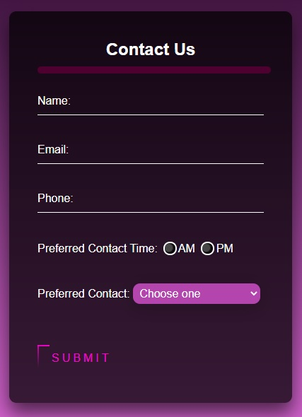

# Custom Form Project

School project:

This project will give me more practice with 
* Typescript 
* source control
* validation
* classes

This project will also give more practice with CSS and making the page be responsive to screen size.

My form looks like this:

Check it out here:
https://tinet0624.github.io/WebFormsAndClasses/